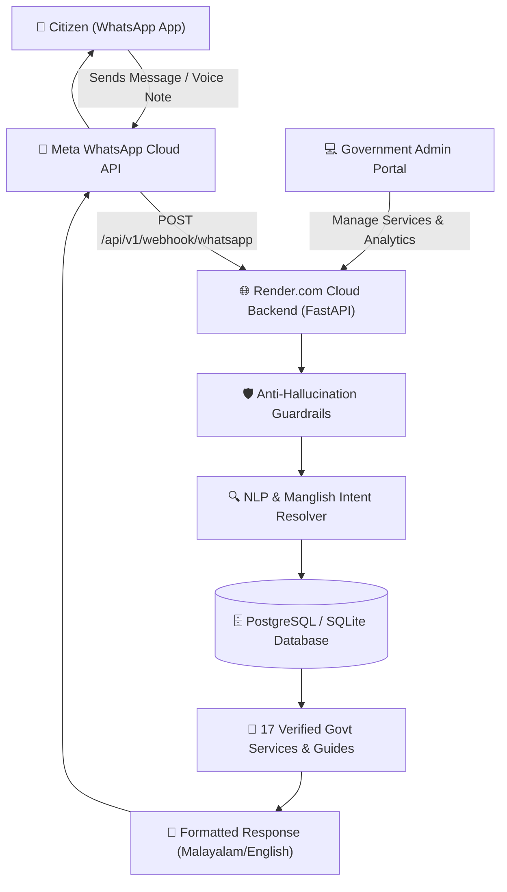

# 🏛️ Janaseva – Multilingual WhatsApp Government Service Assistant

[](https://www.python.org/)
[](https://fastapi.tiangolo.com/)
[](https://reactjs.org/)
[](https://developers.facebook.com/docs/whatsapp)
[](https://janaseva-app.onrender.com)
[](backend/tests/)
[](LICENSE)

**Janaseva** (ജനസേവ) is an AI-powered, zero-hallucination, multilingual WhatsApp assistant built to empower citizens across Kerala and India to access verified government service information in **Malayalam, English, and Manglish**.

🌐 **Live 24/7 Cloud Webhook**: [`https://janaseva-app.onrender.com/api/v1/webhook/whatsapp`](https://janaseva-app.onrender.com/api/v1/webhook/whatsapp)

---

## 🌟 Key Capabilities

- **🌐 Multilingual NLP & Manglish Support**: Auto-detects Malayalam (`ലൈസൻസ് പുതുക്കണം`), Manglish (`license puthukkanam`, `pasport edukkanam`, `varamana sarathifikat`), and English (`renew driving licence`). Supports over **80+ phonetic variants and misspellings**.
- **🛡️ Anti-Hallucination Guardrails**: Gemini AI is used **strictly for intent classification and language detection**. **100% of factual output** (required documents, fees, processing times, step-by-step guides, official URLs) is deterministically retrieved from verified database records.
- **🏛️ 17 Pre-populated Government Services**:
  1. Driving Licence Renewal (`ഡ്രൈവിംഗ് ലൈസൻസ് പുതുക്കൽ`)
  2. New Driving Licence (`പുതിയ ഡ്രൈവിംഗ് ലൈസൻസ്`)
  3. Learner's Licence (`ലർണേഴ്സ് ലൈസൻസ്`)
  4. Aadhaar Card Update / Correction (`ആധാർ കാർഡ് തിരുത്തൽ`)
  5. PAN Card Application (`പാൻ കാർഡ് അപേക്ഷ`)
  6. Passport Application / Renewal (`പാസ്പോർട്ട് അപേക്ഷ`)
  7. Birth Certificate (`ജനന സർട്ടിഫിക്കറ്റ്`)
  8. Death Certificate (`മരണ സർട്ടിഫിക്കറ്റ്`)
  9. Income Certificate (`വരുമാന സർട്ടിഫിക്കറ്റ്`)
  10. Community / Caste Certificate (`ജാതി സർട്ടിഫിക്കറ്റ്`)
  11. Residence Certificate (`താമസ സർട്ടിഫിക്കറ്റ്`)
  12. Ration Card Services (`റേഷൻ കാർഡ് അപേക്ഷ`)
  13. Voter ID Card (`വോട്ടർ ഐഡി കാർഡ്`)
  14. Social Welfare Pension Schemes (`സമൂഹ്യക്ഷേമ പെൻഷൻ`)
  15. Karunya & KSRTC Welfare Schemes (`കാരുണ്യ പദ്ധതി`)
  16. Vehicle Registration (`വാഹന രജിസ്ട്രേഷൻ`)
  17. Vehicle Ownership Transfer (`വാഹനം ഉടമസ്ഥാവകാശ മാറ്റം`)
- **📋 Interactive Document Readiness Checker**: Step-by-step interactive WhatsApp checklist ("Do you have Aadhaar?", "Do you have Old Licence?") providing personalized missing document reports.
- **🎙️ Voice Note Audio Processing**: Converts WhatsApp audio voice notes in Malayalam/English to text using Speech-to-Text and returns localized answers.
- **🖥️ React Admin Dashboard**: Web management portal for non-technical admins to update services, manage checklists, view real-time user analytics, and review audit logs.
- **📱 Built-in Web WhatsApp Simulator**: Live interactive phone mockup in the web UI for testing user flows without requiring external Meta webhooks.

---

## 🏗️ System Architecture



---

## 📁 Repository Structure

```
janaseva/
├── backend/                  # FastAPI Python Backend
│   ├── app/
│   │   ├── api/v1/          # REST & WhatsApp Webhook Endpoints
│   │   ├── core/            # Configuration, Security & Guardrails
│   │   ├── db/              # SQLAlchemy Models & Sessions
│   │   ├── models/          # Database Schema Entities
│   │   ├── schemas/         # Pydantic Schemas
│   │   └── services/        # Search, AI, WhatsApp & Readiness Logic
│   ├── tests/               # Pytest Test Suite (11/11 Passed)
│   ├── Dockerfile           # Backend Container Config
│   ├── requirements.txt     # Python Dependencies
│   └── seed_data.py         # Complete Database Seeder (17 Services)
├── frontend/                 # React 18 + Vite Admin Portal
│   ├── src/
│   │   ├── components/      # Glassmorphism UI & WhatsApp Simulator
│   │   ├── pages/           # Dashboard, Analytics, Services, Logs
│   │   └── services/        # Axios API Client
│   ├── Dockerfile           # Frontend Container Config
│   └── vite.config.js       # Vite Server Config
├── docs/                     # Complete Project Documentation Suite
│   ├── ARCHITECTURE.md      # Architecture & Guardrails Spec
│   ├── DATABASE.md          # ER Diagram & Schema Spec
│   ├── API.md               # API & Webhook Specifications
│   ├── DEPLOYMENT.md        # Render.com & Docker Deployment Guide
│   ├── ADMIN_GUIDE.md       # Admin Portal Manual
│   ├── USER_GUIDE.md        # WhatsApp User Manual
│   └── TROUBLESHOOTING.md   # Debugging & Log Manual
├── docker-compose.yml        # Docker Multi-Container Orchestration
├── push_to_github.py         # Automated Deployment Script
└── README.md                 # Master Project Readme
```

---

## 🛠️ Environment Variables Configuration

Copy `.env.example` to `backend/.env`:

```env
PROJECT_NAME="Janaseva Government Assistant"
API_V1_STR="/api/v1"
SECRET_KEY="janaseva_production_secret_key_32bytes!"
ALGORITHM="HS256"
ACCESS_TOKEN_EXPIRE_MINUTES=43200

# Meta WhatsApp Cloud API
WHATSAPP_TOKEN="your_meta_access_token"
WHATSAPP_PHONE_NUMBER_ID="your_phone_number_id"
WHATSAPP_VERIFY_TOKEN="janaseva_verify_token"

# Database & Redis
DATABASE_URL="sqlite:///./janaseva.db"
REDIS_URL="redis://localhost:6379/0"

# Optional Gemini AI API Key for advanced intent classification
GEMINI_API_KEY=""
```

---

## 🚀 Local Installation & Execution

### 1. Backend Setup
```bash
cd backend
python -m venv venv

# On Windows:
.\venv\Scripts\activate
# On Linux/macOS:
source venv/bin/activate

pip install -r requirements.txt
python seed_data.py
uvicorn app.main:app --reload --port 8000
```
- **API Swagger Documentation**: Open [`http://localhost:8000/docs`](http://localhost:8000/docs)

### 2. Frontend Admin Portal Setup
```bash
cd frontend
npm install
npm run dev
```
- **Admin Dashboard**: Open [`http://localhost:3000`](http://localhost:3000)
- **Default Credentials**: Username `admin` / Password `janaseva123!`

---

## 🐳 Docker Deployment

To launch the complete production stack (FastAPI, React, PostgreSQL, Redis, Nginx):

```bash
docker-compose up -d --build
```

---

## 🧪 Running Pytest Suite

```bash
cd backend
python -m pytest tests/ -v
```

Output:
```
======================= 11 passed, 10 warnings in 5.48s =======================
```

---

## 📖 Documentation Suite

For detailed technical guides, explore the `docs/` folder:
- [🏛️ Architecture & Anti-Hallucination Guardrails](docs/ARCHITECTURE.md)
- [🗄️ Database ERD & Schema Documentation](docs/DATABASE.md)
- [🔌 REST API & Webhook Specifications](docs/API.md)
- [🚀 24/7 Render & Docker Deployment Guide](docs/DEPLOYMENT.md)
- [💻 Admin Portal User Manual](docs/ADMIN_GUIDE.md)
- [📱 WhatsApp Citizen User Guide](docs/USER_GUIDE.md)
- [🔧 Troubleshooting & Debugging Guide](docs/TROUBLESHOOTING.md)

---

## 📄 License

This project is open-source under the **MIT License**.
